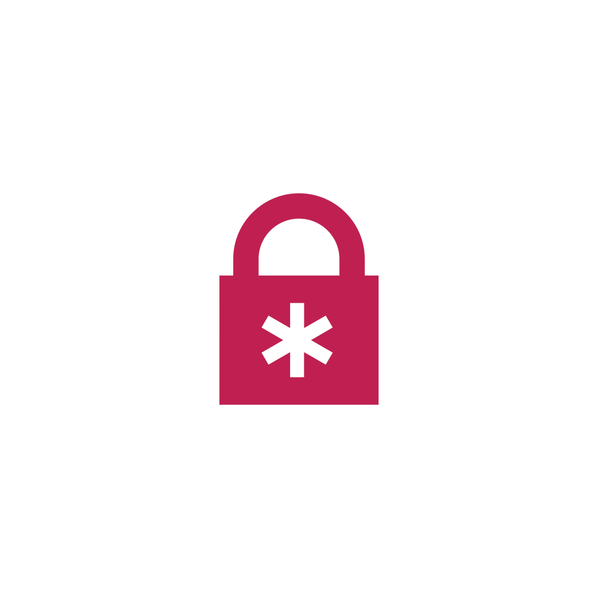
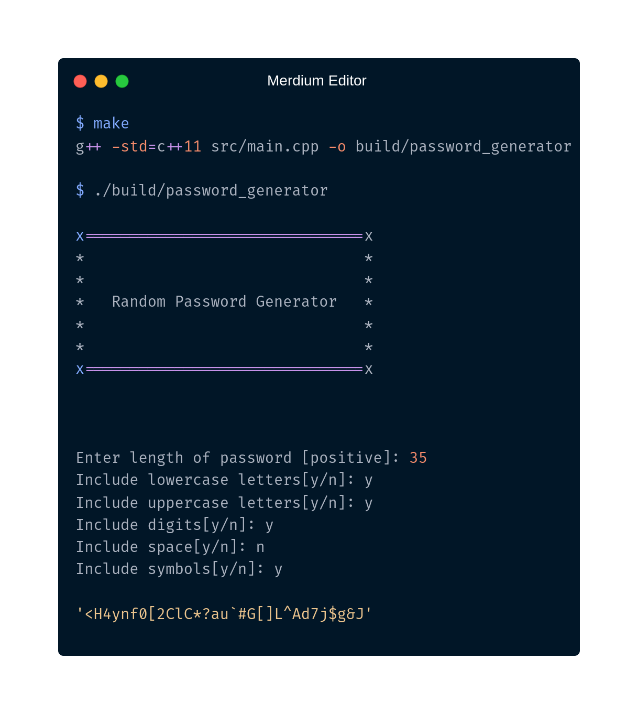

<h2>Fast, secure, simple</h2>
<h3>Create secure passwords in seconds.</h3>

 

<h3>Thanks for selecting us!</h3>
<h4>Made by ~cM</h4>
<h5>More Info: </h5>

<h5>Other links : </h5>
<a href="https://discord.gg/5W4XtHkc6g">Discord</a>
<a href="https://github.com/cMardc">Github</a>
<a href="https://stackoverflow.com/users/21458468/merd-ceferzade">Stack Overflow</a>

